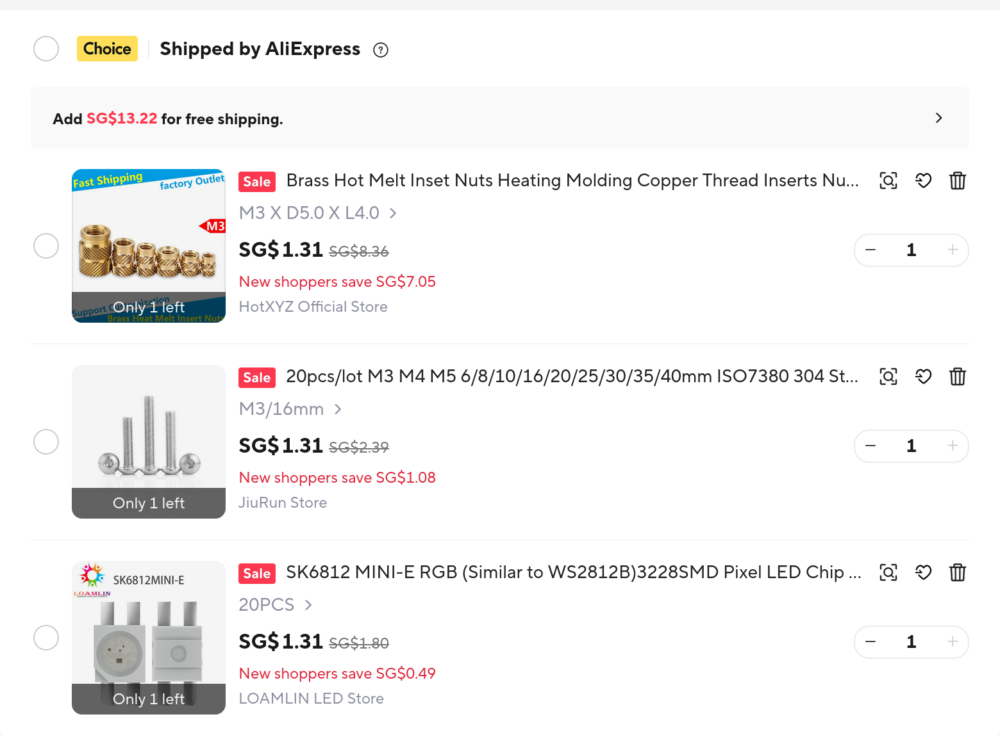

## 16 August: Converted Hackpad to Grounded project

I have a project that I created for Hackpad earlier, but I never submitted it. Alas, Hackpad had ended when I tried submitting it, so it is time to do Grounded instead! It seems some the parts for my hackpad are provided by the hardware grant inventory. Very cool. Please forgive me for the fact that my journal only has one entry, since all of the work was done before Grounded started.

My main problem now is to figure out how to get my parts, with some from the inventory and some from other suppliers using the grant. Looking at my BOM, 6 types of parts are available in the inventory, while 3 are not. I decided to use AliExpress to buy the heatset inserts that Hackpad linked to. I also found screws and addressable LEDs, also on AliExpress, so I added those to the same cart.

I might just get some nicer switches using the budget, because clicky is 🤮. Since it’s a macropad, it isn’t really typing, but individually pressing keys. I think I should get tactile instead of linear, so I know when it actuates. I ended up looking at some tactile switches online and checking each switch’s actuation force and bottom-out force. I also only looked at switches with a transparent casing because I have RGB on my macropad. Eventually I decided on the Gateron Baby Kangaroo 2.0.

**Total time spent: 3h**
