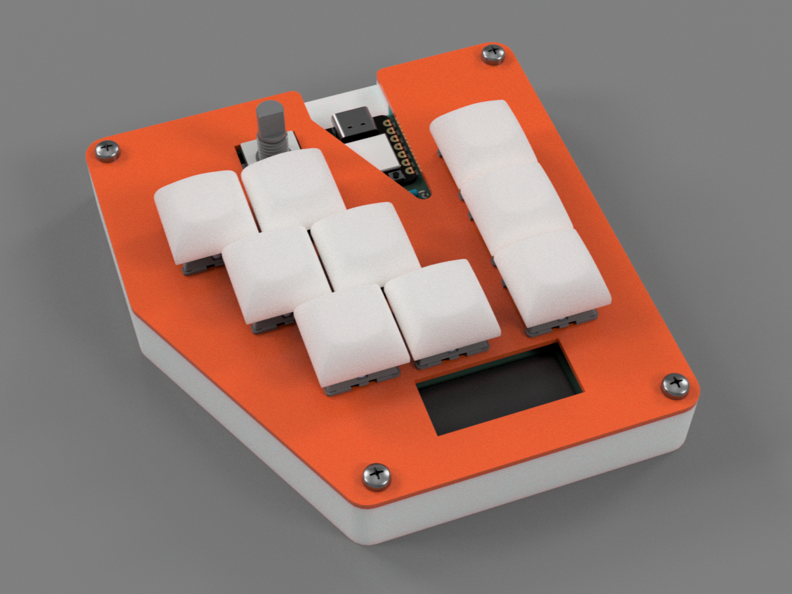
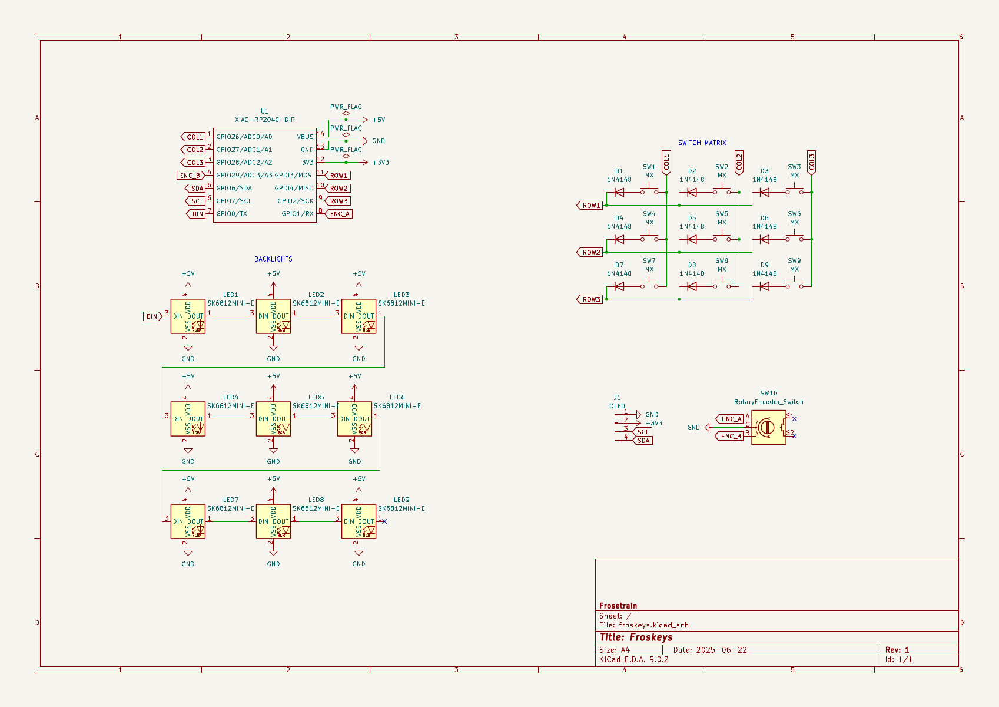
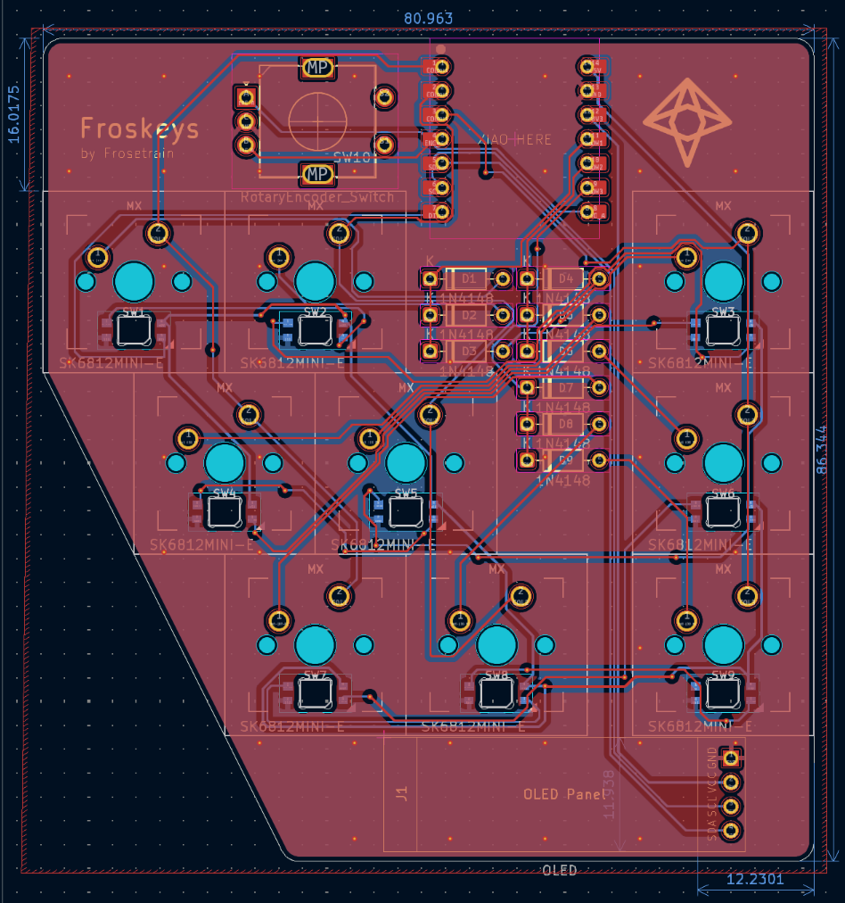
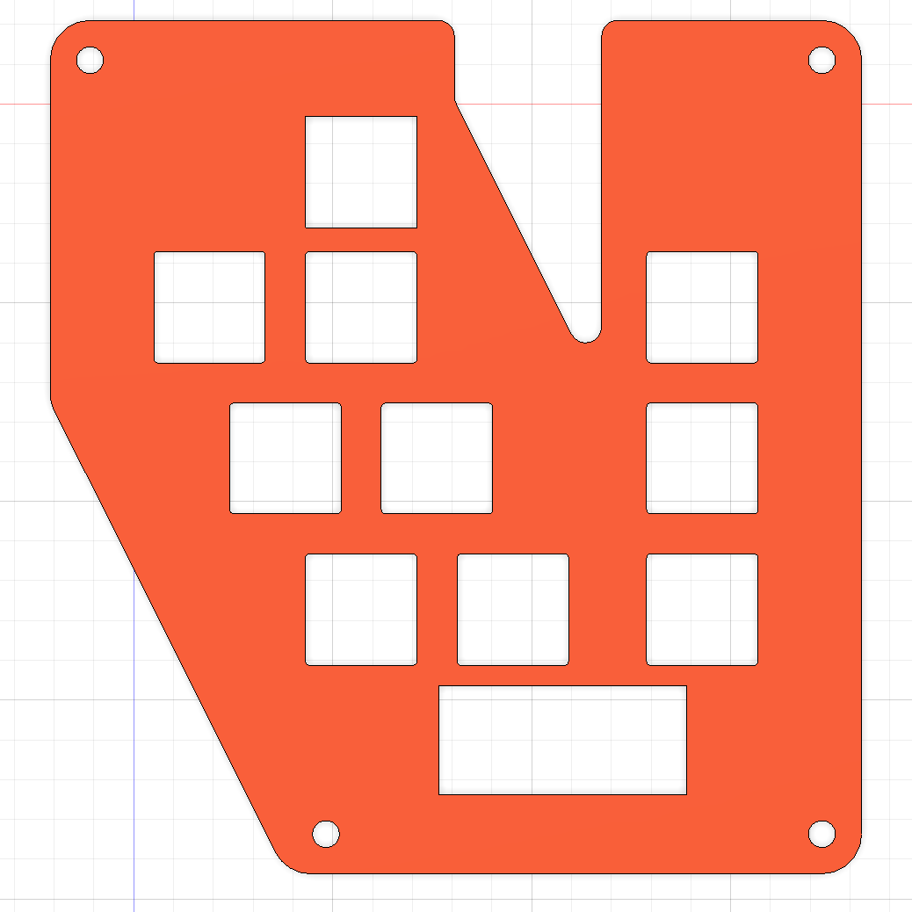
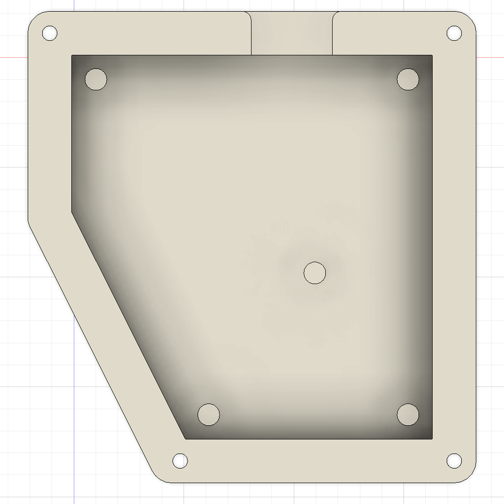
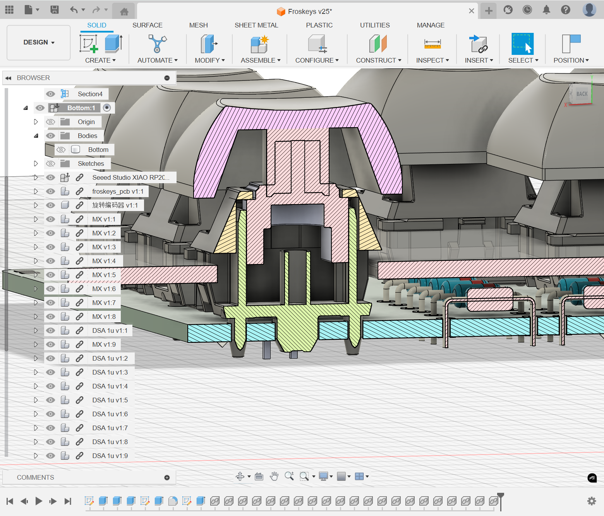

# Froskeys

A macropad that I created for my own use-cases. I wanted some more keys next to my keyboard to do things like push-to-talk and other macros. Since my mouse is on the right of my laptop, my macropad shall sit on the left of my laptop.

There is a column of keys on the right of the macropad, to easily press with my pinky while my left hand is on WASD.

There is a diagonal cutout on the bottom left, where I can rest my hand more easily.

## Keys

-   Control+Z (undo) and Control+Y (redo)
-   Control+C (copy) and Control+V (paste), the only two keys I need
-   Control+D (duplicate)
-   F2 (rename)
-   Play/pause
-   Push-to-talk
-   `sudo pacman -Syu` (average arch user)

## Schematic

## PCB

## Case

| Top                         | Bottom                            |
| --------------------------- | --------------------------------- |
|  |  |

Section analysis was a very useful feature

## BOM

-   1 × Seeed XIAO RP2040 (SMD) (doing smd might be torturous)
-   9 × 1N4148 diode
-   9 × MX-style switch
-   1 × EC11 rotary encoder
-   1 × 0.91 inch OLED display
-   9 × DSA keycap
-   9 × SK6812 MINI-E LED
-   4 × M3×16mm screw
-   4 × M3×5mm×4mm heatset insert
